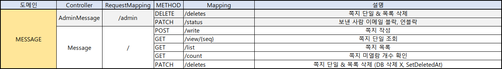
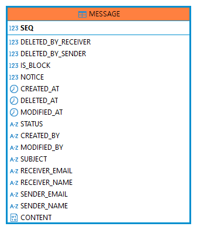

# ✉Message-Service✉

## ✉서비스 URL✉

### ✉관리자✉
- 쪽지 단일 | 목록 일괄 삭제(DB 삭제 O)
- 보낸 사람 이메일 블락, 언블락

### ✉사용자 회원✉
- 쪽지 작성
- 쪽지 단일 조회
- 쪽지 목록 일괄 조회
- 쪽지 미열람 개수
- 쪽지 단일 | 목록 일괄 삭제(DB 삭제 X)

## ERD

- SEQ : 메세지 번호(기본키)
- DELETED_BY_RECEIVER : 받는 사람이 삭제 여부
- DELETED_BY_SENDER : 보낸 사람이 삭제 여부
- IS_BLOCK : 블락 여부
- NOTICE : 공지
- CREATED_AT : 작성 날짜
- DELETED_AT : 삭제 날짜
- MODIFIED_AT : 수정 날짜
- STATUS : 상태
- CREATED_BY : 작성자 이메일
- MODIFIED_BY : 수정자 이메일
- SUBJECT : 제목
- RECEIVER_EMAIL : 받는 사람 이메일
- RECEIVER_NAME : 받는 사람 이름
- SENDER_EMAIL : 보낸 사람 이메일
- SENDER_NAME : 보낸 사람 이름
- CONTENT : 내용

## 스웨거 API
http://cis-message-service.koreait.xyz/apidocs.html

## MESSAGE SERVICE 담당자 & 역할
오준학
- 쪽지 유저(작성, 조회, 목록, 미열람, 삭제) 서비스
- 관리자(삭제, 블락, 언블락처리) 서비스

## MESSAGE_INFO
| 키  | 논리          | 물리                  | 도메인           | 타입          | Length | UNIQUE | NULL허용 | 기본값 |
|:--:|-------------|---------------------|---------------|-------------|--------|--|--------|---|
| pk | 쪽지 번호       | SEQ                 | Long          | NUMBER      |        |        |
|    | 공지          | NOTICE              | Boolean       | NUMBER(1,0) |        |        | N      |   |       |
|    | 상태 | STATUS              | String        | VARCHAR     | 10     |         | N      |   |       |
|    | 블락          | ISBLOCK             | Boolean       | NUMBER(1,0) |        |        | N      |
|    | 보낸 사람 이메일   | SENDER_EMAIL        | String        | VARCHAR     |        |        |        |   |       |
|    | 보낸 사람 이름    | SENDER_NAME         | String        | VARCHAR     |        |        |        |   |       |
|    | 받은 사람 이메일   | RECEIVER_EMAIL      | String        | VARCHAR     |        |        |        |   |       |
|    | 받은 사람 이름    | RECEIVER_NAME       | String        | VARCHAR     |        |        |        |   |       |
|    | 제목          | SUBJECT             | String        | VARCHAR     | 150    |        | N      |   |       |
|    | 내용          | CONTENT             | String        | CLOB        |        |        | N      |   |       |
|    | 보낸 사람이 삭제   | DELETED_BY_SENDER   | Boolean       | NUMBER(1,0) |        |        | N      |   |       |
|    | 받은 사람이 삭제   | DELETED_BY_RECEIVER | Boolean       | NUMBER(1,0) |        |        | N      |   |       |
|    | 등록일시        | CREATED_AT          | LocalDateTime | TIMESTAMP   |        |         |        | SYSDATE 
|    | 수정일시        | MODIFIED_AT         | LocalDateTime | TIMESTAMP   |        |         |        | SYSDATE 
|    | 삭제일시        | DELETED_AT          | LocalDateTime | TIMESTAMP   |        |         |        | SYSDATE 